<div align="center">

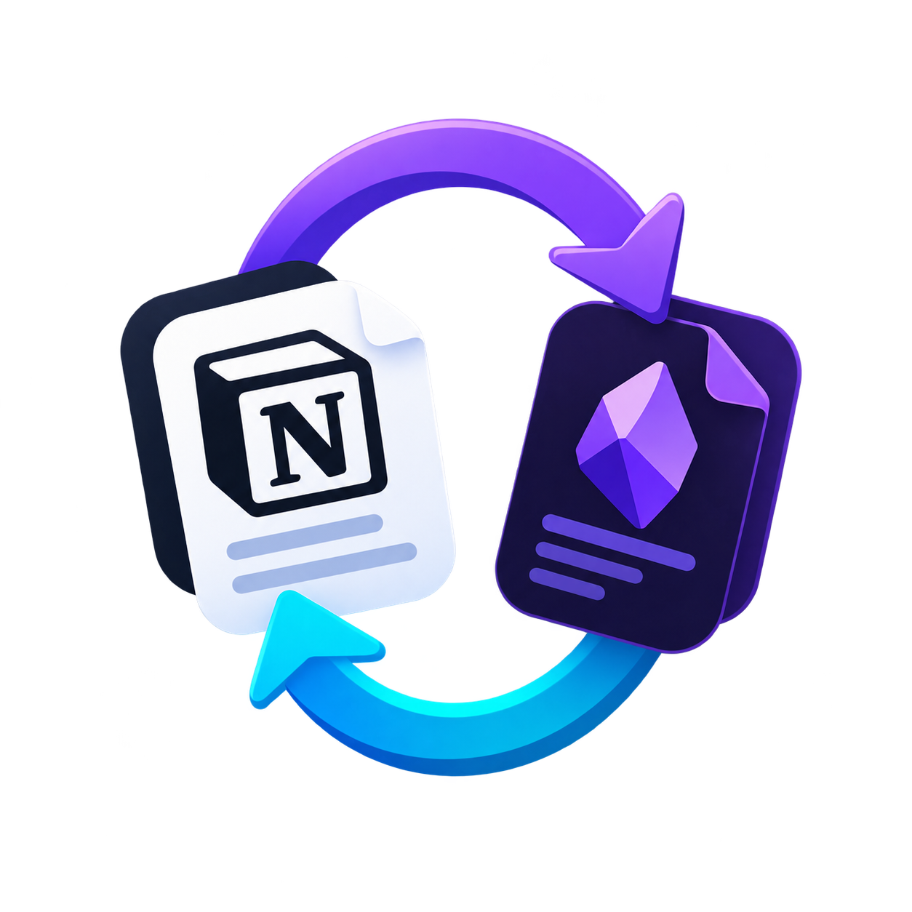

# Notesync

### Your notes, wherever you work.

**Bidirectional synchronization between Notion and Obsidian, built as a developer-first CLI.**

Notesync keeps your Obsidian Markdown vault and Notion workspace in sync — tracking changes, detecting conflicts, and preserving synchronization state locally.

<br />

[](https://go.dev/)
[](https://www.typescriptlang.org/)
[](https://nodejs.org/)
[](https://www.sqlite.org/)
[](https://developers.notion.com/)
[](https://obsidian.md/)

[](LICENSE)
[](#-status)
[](#-contributing)
[](#-cicd)

</div>

<br />

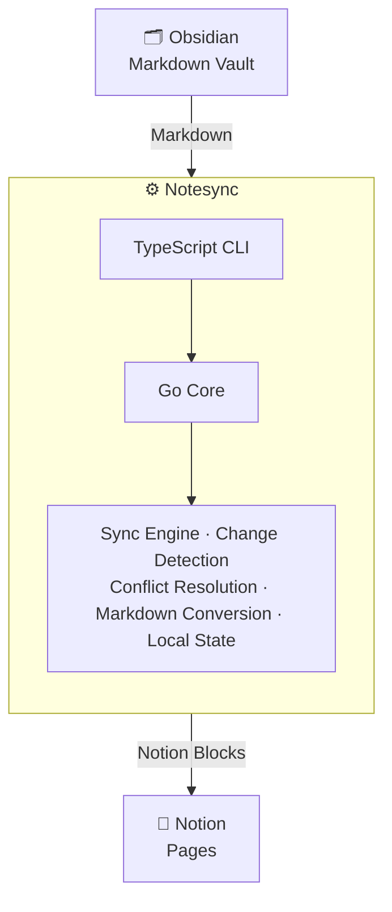

---

## ✨ Features

| | | |
|---|---|:-:|
| 🔄 **Bidirectional sync** | Between Obsidian and Notion | ✅ |
| 📝 **Markdown ↔ Blocks** | Markdown to Notion block conversion (both directions) | ✅ |
| 🔍 **Change detection** | Per-side comparison powered by content hashes | ✅ |
| ⚠️ **Conflict handling** | Detection, interactive resolution, three-way merge | ✅ |
| 🧪 **Dry-run mode** | Preview every change safely | ✅ |
| 🗑️ **Deletion handling** | Soft-delete both sides; opt-in propagation | ✅ |
| 🗃️ **Local state** | Persisted in SQLite | ✅ |
| 📜 **Sync history** | Full audit of past operations | ✅ |
| 👀 **Watch mode** | Automatic sync on file changes | ✅ |
| 🔐 **Secure auth** | Notion token stored in the OS credential store | ✅ |
| 🖥️ **Cross-platform** | Linux · macOS · Windows | ✅ |
| 🚀 **Native core** | Fast Go engine with a friendly TypeScript CLI | ✅ |
| 🧩 **Modular** | Architecture designed for future providers | ✅ |

---

## 🎯 Why Notesync?

Notion and Obsidian serve different purposes.

**Obsidian** gives you local-first Markdown files, portability, Git compatibility, and complete ownership of your notes.

**Notion** provides a powerful collaborative workspace with databases, structured pages, sharing, and cloud accessibility.

Notesync combines the strengths of both. Instead of treating synchronization as a simple file-copy operation, it maintains synchronization state and understands that changes can happen independently on either side.

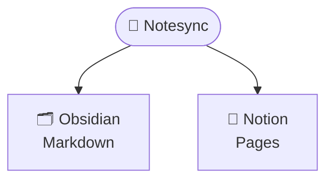

---

## 🏗️ Architecture

Notesync uses a hybrid **TypeScript + Go** architecture that deliberately separates the **CLI experience** from the **synchronization engine**, allowing both layers to evolve independently. The Go core follows a **hexagonal (ports & adapters)** design — a domain layer of pure business logic sits behind well-defined ports, with swappable adapters for Obsidian, Notion, SQLite, and the OS credential store.

<div align="center">

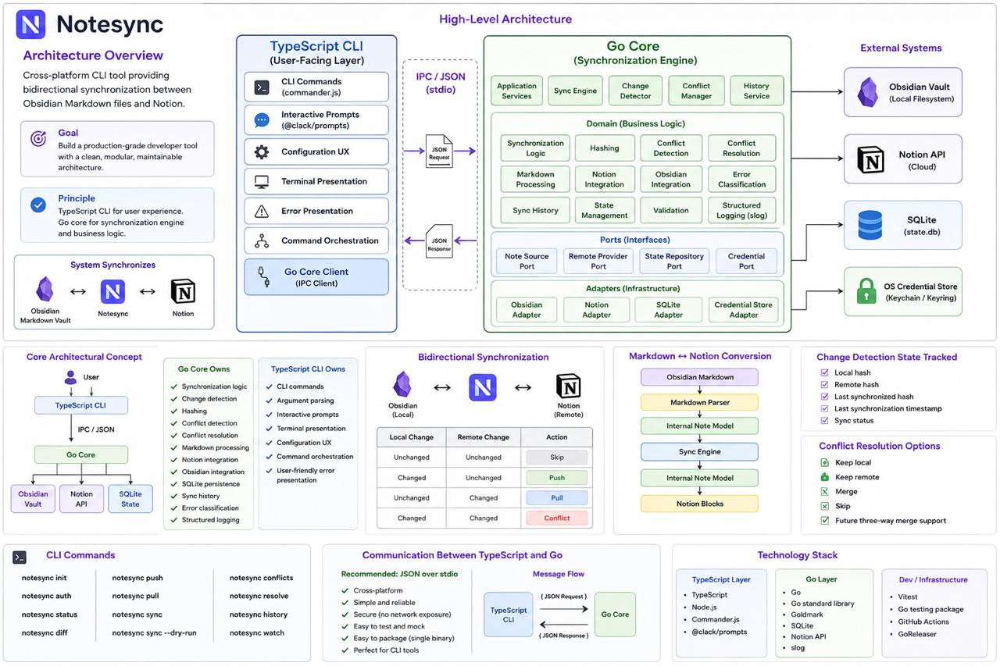

<sub><i>High-level architecture — TypeScript CLI ↔ Go Core (domain, ports, adapters) ↔ external systems</i></sub>

</div>

<table>
<tr>
<th width="50%">

###  TypeScript

The user-facing CLI and terminal experience.

- CLI commands
- Argument parsing
- Interactive prompts
- Configuration handling
- User-facing output
- Command orchestration

</th>
<th width="50%">

###  Go

The core synchronization engine.

- File system operations
- Markdown processing & change detection
- Synchronization algorithms
- Conflict detection & three-way merge
- Notion integration
- SQLite state management
- Concurrent operations & structured logging

</th>
</tr>
</table>

### 🧱 Layered Design

The Go core is organized into three concentric layers connected to the outside world through ports and adapters:

| Layer | Contents |
| :--- | :--- |
| **Application Services** | Sync Engine · Change Detector · Conflict Manager · History Service |
| **Domain (Business Logic)** | Synchronization logic · Hashing · Conflict detection & resolution · Markdown processing · Notion/Obsidian integration · Validation · Sync history · State management · Error classification · Structured logging |
| **Ports (Interfaces)** | Note Source Port · Remote Provider Port · State Repository Port · Credential Port |
| **Adapters (Infrastructure)** | Obsidian Adapter · Notion Adapter · SQLite Adapter · Credential Store Adapter |

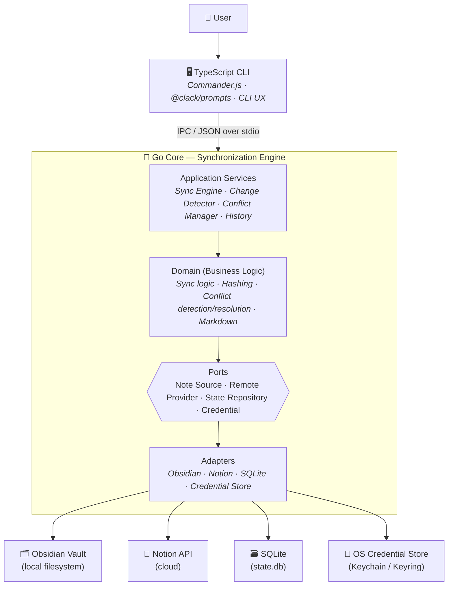

---

## 📊 Use Cases

The diagram below maps each CLI command to the underlying operations it triggers and the external systems it touches.

<div align="center">

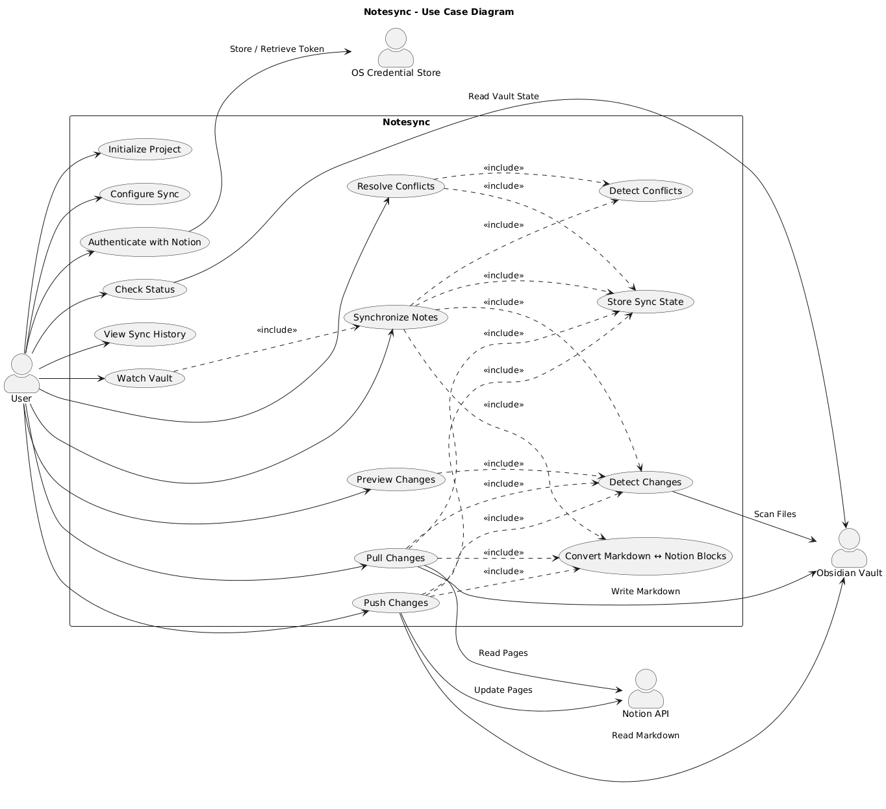

<sub><i>Actor-level view — user commands, included operations, and external actors (Notion API, Obsidian Vault, OS Credential Store)</i></sub>

</div>

| User action | Includes | Touches |
| :--- | :--- | :--- |
| Initialize Project | — | — |
| Authenticate with Notion | — | OS Credential Store |
| Synchronize Notes | Detect Changes · Detect Conflicts · Convert Markdown ↔ Blocks · Store Sync State | Notion API · Obsidian Vault |
| Push Changes | Detect Changes · Convert Markdown ↔ Blocks · Store Sync State | Notion API · Obsidian Vault |
| Pull Changes | Detect Changes · Convert Markdown ↔ Blocks · Store Sync State | Notion API · Obsidian Vault |
| Resolve Conflicts | Detect Conflicts · Three-way Merge · Store Sync State | Notion API · Obsidian Vault |
| Watch Vault | Synchronize Notes (on change) | Notion API · Obsidian Vault |
| Check Status / View History | — | — |

---

## 🧰 Tech Stack

<div align="center">

&nbsp;&nbsp;
&nbsp;&nbsp;
&nbsp;&nbsp;
&nbsp;&nbsp;
&nbsp;&nbsp;
&nbsp;&nbsp;


</div>

<br />

| Layer | Technology |
| ------------------ | -------------------- |
|  Core | Go |
|  CLI | TypeScript / Node.js |
| ⚡ CLI Framework | Commander.js |
| 🎨 Terminal UX | @clack/prompts |
| 👀 File Watching | chokidar |
|  Markdown | Goldmark |
|  Database | SQLite (modernc.org/sqlite, pure Go) |
|  Remote API | Notion API |
| 🔐 Credentials | OS keyring (zalando/go-keyring) |
| 📋 Logging | Go `slog` |
|  TS Testing | Vitest |
|  Go Testing | Go `testing` |
|  CI/CD | GitHub Actions |
| 📦 Releases | GoReleaser |

---

## 📦 Project Structure

```text
notesync/
├── cli/                        # TypeScript CLI
│   ├── src/
│   │   ├── commands/
│   │   ├── config/
│   │   ├── core/               # IPC client to the Go core
│   │   └── index.ts
│   ├── package.json
│   └── tsconfig.json
│
├── core/                       # Go synchronization engine
│   ├── cmd/notesync-core/
│   │   └── main.go
│   ├── internal/
│   │   ├── sync/               # hashing, change detection, three-way merge
│   │   ├── obsidian/           # vault discovery, trash
│   │   ├── notion/             # API client, blocks ↔ markdown
│   │   ├── markdown/           # Goldmark parsing
│   │   ├── storage/            # SQLite state + migrations
│   │   ├── auth/               # OS keyring
│   │   ├── config/
│   │   └── ipc/
│   ├── .goreleaser.yaml
│   ├── go.mod
│   └── go.sum
│
├── docs/
│   └── architecture/
│
├── .github/workflows/
├── assets/
├── LICENSE
└── README.md
```

---

## 🚀 Getting Started

### Requirements

-  **Node.js** 20+
-  **Go** 1.24+
-  A **Notion** integration
- 🗂️ An **Obsidian** vault

> **No C compiler required** — Notesync uses a pure-Go SQLite driver, so builds and cross-compilation work out of the box.

### Installation

**From source**

```bash
git clone https://github.com/Mazennaji/notesync.git
cd notesync

# Build the TypeScript CLI
cd cli
npm install
npm run build
cd ..

# Build the Go core
cd core
go build -o notesync-core ./cmd/notesync-core
cd ..
```

---

## ⚡ Quick Start

```bash
notesync init      # Initialize Notesync inside your Obsidian vault
notesync auth      # Authenticate with Notion (token stored in OS keyring)
notesync parent    # Set the Notion parent page for new notes
notesync scan      # Discover Markdown notes in the vault
notesync pages     # Discover Notion pages and link them by title
notesync create    # Create Notion pages for notes not yet linked
notesync sync      # Synchronize both directions
```

> Notesync commands are run from **inside your Obsidian vault** — the folder containing `.notesync/`.

---

## 🖥️ CLI Reference

| Command | Description |
| ------- | ----------- |
| `notesync init` | Initialize a Notesync configuration |
| `notesync auth` | Configure Notion authentication |
| `notesync logout` | Remove stored Notion credentials |
| `notesync parent` | Set the Notion parent page for new notes |
| `notesync scan` | Discover Markdown notes in the vault |
| `notesync pages` | Discover Notion pages and link them to vault notes |
| `notesync create` | Create Notion pages for notes not yet linked |
| `notesync status` | Display synchronization status |
| `notesync diff` | Show changes that would be synchronized (read-only) |
| `notesync push` | Push local Obsidian changes to Notion |
| `notesync pull` | Pull remote Notion changes into Obsidian |
| `notesync sync` | Synchronize both directions |
| `notesync sync --dry-run` | Preview synchronization without modifying data |
| `notesync sync --delete` | Propagate deletions (archive pages / trash files) |
| `notesync conflicts` | List unresolved synchronization conflicts |
| `notesync resolve` | Interactively resolve conflicts (keep local / remote / merge) |
| `notesync history` | Display previous synchronization operations |
| `notesync watch` | Watch the vault and synchronize automatically |
| `notesync watch -i <seconds>` | Also poll Notion every N seconds for remote changes |
| `notesync completion` | Output a shell completion script (bash / zsh / powershell) |
| `notesync --verbose <command>` | Run any command with internal core logs shown |

---

## 🔄 Synchronization Model

Notesync does not simply compare file timestamps. Each synchronized note maintains state representing the relationship between its local and remote versions. **Each side is compared against its own last-synced baseline** — never local directly against remote — which keeps detection stable even though Markdown ↔ Notion round-trips are not byte-identical.

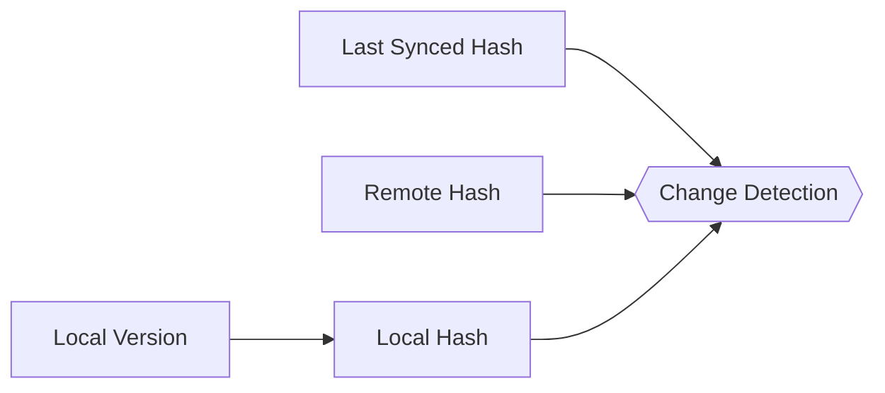

The engine determines whether each side has changed:

| Local | Remote | Result |
| :--------- | :--------- | :------- |
| unchanged | unchanged | ⏭️ Skip |
| changed | unchanged | ⬆️ Push |
| unchanged | changed | ⬇️ Pull |
| changed | changed | ⚠️ Conflict |

This lets Notesync distinguish between normal updates and genuine conflicts.

---

## ⚠️ Conflict Resolution

Conflicts occur when the same note changes independently on both sides. When Notesync can't safely decide, it **records the conflict and touches neither version** — nothing is overwritten.

```text
⚠ Conflict detected

Note:
  Projects/ClientFlow.md

Local changes:
  Added API architecture section

Remote changes:
  Added database schema section
```

Run `notesync resolve` for interactive resolution:

```text
? How should this conflict be resolved?

❯ Merge — combine both (markers if they overlap)
  Keep local — overwrite Notion
  Keep remote — overwrite local file
  Skip — decide later
```

**Three-way merge** uses the last-synced content as a base. Non-overlapping edits merge cleanly; overlapping edits are written with Git-style `<<<<<<<` / `=======` / `>>>>>>>` markers for you to resolve by hand. The goal is to make synchronization **safe and explicit** rather than silently overwriting your data.

---

## 📝 Markdown Conversion

Obsidian stores notes as Markdown while Notion represents content using blocks. Notesync uses an intermediate representation to keep parsing and conversion independent from the sync engine.

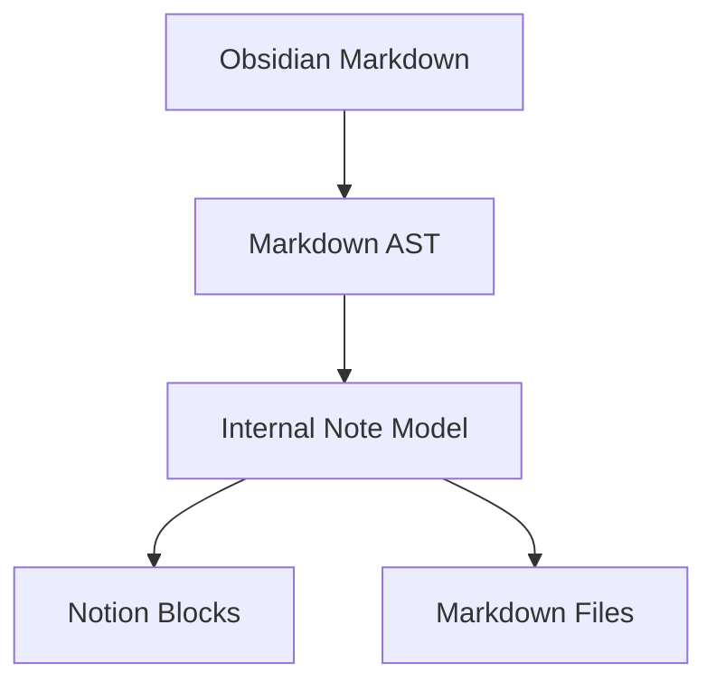

**Supported Markdown features:**

`Headings` · `Paragraphs` · `Bold / Italic` · `Strikethrough` · `Inline code` · `Links` · `Bullet lists` · `Ordered lists` · `Checklists` · `Code blocks` · `Blockquotes` · `Horizontal rules`

---

## 🗃️ Local State

Notesync stores synchronization metadata locally using SQLite:

```text
.notesync/
├── config.json       # vault path, Notion parent, sync mode
├── state.db          # sync state, conflicts, history
└── trash/            # soft-deleted local files
```

The schema is organized around a central `NOTE` entity: a `CONFIGURATION` contains many notes, each note **tracks** one `SYNC STATE`, and **has** conflicts and sync-history records.

<div align="center">

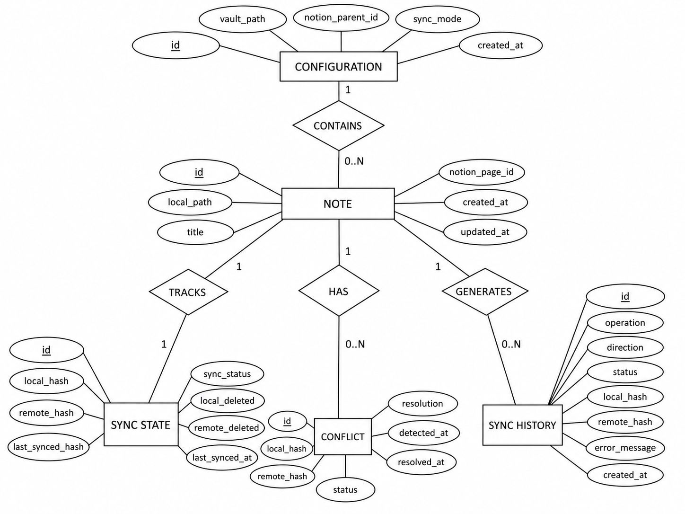

<sub><i>Entity–relationship schema for the local SQLite state database</i></sub>

</div>

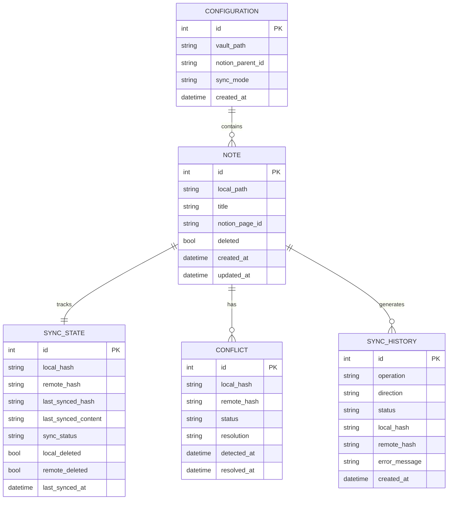

<details>
<summary><b>Schema reference</b></summary>

**CONFIGURATION** — `id` · `vault_path` · `notion_parent_id` · `sync_mode` · `created_at`

**NOTE** — `id` · `local_path` · `title` · `notion_page_id` · `deleted` · `created_at` · `updated_at`

**SYNC STATE** — `id` · `local_hash` · `remote_hash` · `last_synced_hash` · `last_synced_content` · `sync_status` · `local_deleted` · `remote_deleted` · `last_synced_at`

**CONFLICT** — `id` · `local_hash` · `remote_hash` · `status` · `resolution` · `detected_at` · `resolved_at`

**SYNC HISTORY** — `id` · `operation` · `direction` · `status` · `local_hash` · `remote_hash` · `error_message` · `created_at`

</details>

SQLite lets Notesync maintain reliable local state without requiring a separate server.

---

## 🔐 Security

Security is a core requirement of Notesync.

- 🔑 The Notion token is stored in the **OS credential store** (Windows Credential Manager · macOS Keychain · Linux Secret Service) — never in the repo or config files.
- 🗝️ The token is validated against Notion **before** being saved; an invalid token never touches the keyring.
- 📎 Configuration files reference credentials rather than storing raw secrets.

**Sensitive information is never written to:**

`Git repositories` · `Logs` · `SQLite state` · `Error messages` · `Terminal output`

---

## 🧪 Testing

Notesync is designed around automated testing.

<table>
<tr>
<th width="50%">

###  TypeScript — Vitest

```bash
npm test
```

Covers CLI commands, configuration, argument parsing, user interaction logic, and command orchestration.

</th>
<th width="50%">

###  Go — `go test`

```bash
go test ./...
```

Covers sync algorithms, change detection, hashing, conflict detection, three-way merge, Markdown conversion, Notion mapping, SQLite persistence, and file operations.

</th>
</tr>
</table>

---

## 🧑‍💻 Development

```bash
# Clone
git clone https://github.com/Mazennaji/notesync.git
cd notesync

# Build the CLI
cd cli
npm install
npm run build
cd ..

# Build the Go core
cd core
go build -o notesync-core ./cmd/notesync-core
cd ..
```

---

## 🔁 CI/CD

GitHub Actions runs on every pull request:

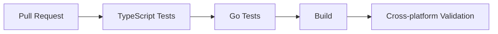

Tagged releases (`v*`) trigger **GoReleaser** to build platform-specific binaries and attach them to a GitHub release.

| Platforms | Architectures |
| :--- | :--- |
| 🐧 Linux · 🍎 macOS · 🪟 Windows | `amd64` · `arm64` |

---

## 🗺️ Roadmap

<details>
<summary><b>Phase 1 — Foundation ✅</b></summary>

- [x] Repository setup
- [x] TypeScript CLI
- [x] Go core
- [x] CLI ↔ Go communication
- [x] Configuration
- [x] SQLite state
- [x] Obsidian vault discovery

</details>

<details>
<summary><b>Phase 2 — Notion Integration ✅</b></summary>

- [x] Notion authentication
- [x] Notion API client
- [x] Page discovery
- [x] Page creation
- [x] Page updates
- [x] Block conversion

</details>

<details>
<summary><b>Phase 3 — Synchronization ✅</b></summary>

- [x] Change detection
- [x] Content hashing
- [x] Push
- [x] Pull
- [x] Bidirectional sync
- [x] Deletion handling
- [x] Dry-run mode

</details>

<details>
<summary><b>Phase 4 — Conflict Management ✅</b></summary>

- [x] Conflict detection
- [x] Conflict storage
- [x] Interactive resolution
- [x] Three-way merge support
- [x] Conflict history

</details>

<details open>
<summary><b>Phase 5 — Developer Experience 🚧</b></summary>

- [x] Sync history
- [x] Watch mode
- [x] Improved terminal UI
- [x] Detailed diagnostics (`--verbose`)
- [x] Shell completions
- [x] Cross-platform releases (GoReleaser config + workflow)

</details>

<details>
<summary><b>Future</b></summary>

- [ ] Published npm package with bundled binaries
- [ ] Additional note providers
- [ ] Plugin architecture
- [ ] Advanced Markdown support (tables, images)
- [ ] Git-aware workflows
- [ ] Remote synchronization state
- [ ] TypeScript SDK

</details>

---

## 🧩 Design Principles

| Principle | Meaning |
| :--- | :--- |
| 🏠 **Local-first** | Your Obsidian vault remains the source of your local files |
| 🛡️ **Safe by default** | Synchronization never silently destroys user data |
| ✋ **Explicit conflicts** | When automatic sync is unsafe, Notesync stops and asks |
| 🎯 **Deterministic** | The same state always produces the same sync decision |
| 🔌 **Provider independence** | The engine is not tightly coupled to Notion-specific logic |
| 💻 **Developer-first UX** | The CLI is scriptable, predictable, informative, pleasant |
| 🧱 **Extensible** | New providers can be added without rewriting the core |

---

## 📐 Project Goals

Notesync is not just another API wrapper. It demonstrates how to build a production-grade developer tool involving CLI architecture, Go systems programming, TypeScript application development, API integration, Markdown parsing, data synchronization, conflict resolution, local persistence, authentication, testing, CI/CD, and cross-platform distribution.

---

## 🤝 Contributing

Contributions are welcome! Before submitting a pull request:

```bash
npm test
cd core && go test ./...
```

Please keep changes focused, tested, and consistent with the project's architecture.

---

## 📄 License

This project is licensed under the **MIT License** — see [`LICENSE`](LICENSE) for details.

---

## 🚧 Status

> **Notesync has a working MVP.** All five phases are functionally complete — setup, Notion integration, full bidirectional synchronization, conflict management with three-way merge, and developer-experience tooling (watch mode, history, diagnostics, shell completions, and a GoReleaser-based release pipeline).
>
> The project is built with a focus on correctness, safety, developer experience, and maintainability.

---

<div align="center">

## 👤 Author

**Mazen Naji** — Software Engineer focused on backend systems, software architecture, and AI engineering.

[](https://github.com/Mazennaji)

<br />

### 🔄 Notesync — Your notes, wherever you work.

<sub>If you find this project useful, consider giving it a ⭐</sub>

</div>